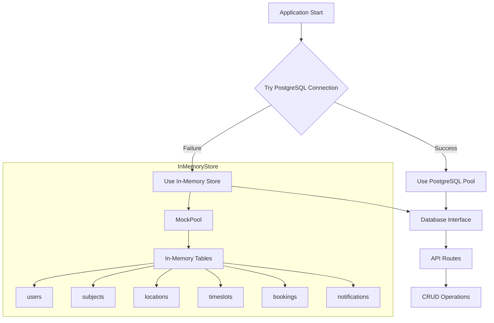

# Database Fallback Architecture

## Overview

This document describes the architecture for a graceful fallback mechanism that allows the UniHelp application to run without PostgreSQL installed. The system will attempt to connect to PostgreSQL first, and if unavailable, automatically switch to an in-memory data store.

## Design Principles

1. **PostgreSQL-First**: Always attempt PostgreSQL connection first
2. **Transparent Fallback**: Rest of application unaware of which database is being used
3. **Interface Consistency**: In-memory store implements same interface as PostgreSQL pool
4. **Full CRUD Support**: All database operations work in both modes
5. **Development-Friendly**: Easy local development without PostgreSQL setup

## Architecture Diagram



## File Structure

```
server/
├── db/
│   ├── index.js           # Main export - chooses between pg and mock
│   ├── pool.js            # PostgreSQL connection pool
│   └── mock/
│       ├── index.js       # Mock database pool interface
│       ├── data.js        # In-memory data store with dummy data
│       └── queries.js     # SQL-like query implementations
```

## Interface Design

The mock database must implement the same interface as the PostgreSQL pool:

### PostgreSQL Pool Interface
```javascript
// Query method used throughout the application
pool.query(text, params) → Promise<{ rows, rowCount, fields }>

// Connect method for transactions
pool.connect() → Promise<client>

// Event emitters
pool.on('error', callback)
```

### Mock Pool Implementation
```javascript
class MockPool {
    constructor(data)
    
    // Main query method - parses SQL and returns matching data
    async query(text, params) → Promise<{ rows, rowCount, fields }>
    
    // Connect for transactions - returns mock client
    async connect() → Promise<MockClient>
    
    // Event emitter support
    on(event, callback)
}
```

## Supported SQL Operations

The mock database must handle these SQL operations used by the application:

### SELECT Queries
```sql
-- Get user by email
SELECT * FROM users WHERE email = $1

-- Get user by ID
SELECT * FROM users WHERE id = $1

-- Get all subjects
SELECT * FROM subjects

-- Get timeslots with joins
SELECT t.*, s.subject_name, l.room_name, u.full_name as lecturer_name
FROM timeslots t
JOIN subjects s ON t.subject_id = s.id
JOIN locations l ON t.location_id = l.id
JOIN users u ON t.lecturer_id = u.id
WHERE t.day_of_week = $1

-- Get bookings for student
SELECT b.*, t.start_time, t.end_time, s.subject_name
FROM bookings b
JOIN timeslots t ON b.timeslot_id = t.id
JOIN subjects s ON t.subject_id = s.id
WHERE b.student_id = $1
```

### INSERT Queries
```sql
-- Create user
INSERT INTO users (full_name, email, password_hash, role) VALUES ($1, $2, $3, $4) RETURNING *

-- Create booking
INSERT INTO bookings (student_id, timeslot_id, seat_number) VALUES ($1, $2, $3) RETURNING *

-- Create notification
INSERT INTO notifications (user_id, timeslot_id, message) VALUES ($1, $2, $3) RETURNING *
```

### UPDATE Queries
```sql
-- Update user
UPDATE users SET full_name = $1 WHERE id = $2 RETURNING *

-- Update timeslot
UPDATE timeslots SET lecture_topic = $1, notice = $2 WHERE id = $3 RETURNING *

-- Mark notification read
UPDATE notifications SET is_read = true WHERE id = $1

-- Update booking status
UPDATE bookings SET attendance_status = $1 WHERE id = $2
```

### DELETE Queries
```sql
-- Delete booking
DELETE FROM bookings WHERE id = $1 AND student_id = $2

-- Delete notification
DELETE FROM notifications WHERE id = $1
```

## Data Initialization

The mock database will be initialized with data from `z-database/dummy_data.sql`:

```javascript
// server/db/mock/data.js
const bcrypt = require('bcrypt');

// Pre-hashed passwords for testing
// These will be generated at startup
const ADMIN_PASSWORD_HASH = await bcrypt.hash('admin123', 10);
const LECTURER_PASSWORD_HASH = await bcrypt.hash('lecturer123', 10);
const STUDENT_PASSWORD_HASH = await bcrypt.hash('student123', 10);

const initialData = {
    users: [
        { id: 1, full_name: 'Admin User', email: 'admin@unihelp.com', password_hash: ADMIN_PASSWORD_HASH, role: 'admin' },
        { id: 2, full_name: 'Dr. John Smith', email: 'john.smith@unihelp.com', password_hash: LECTURER_PASSWORD_HASH, role: 'lecturer' },
        // ... more users
    ],
    subjects: [/* ... */],
    locations: [/* ... */],
    timeslots: [/* ... */],
    bookings: [/* ... */],
    notifications: [/* ... */]
};
```

## Connection Flow

```javascript
// server/db/index.js
const { Pool } = require('pg');
const MockPool = require('./mock');

let db;
let isMock = false;

async function initializeDatabase() {
    try {
        // Try PostgreSQL first
        const pool = new Pool({
            host: process.env.DB_HOST || 'localhost',
            port: process.env.DB_PORT || 5432,
            database: process.env.DB_NAME || 'unihelp',
            user: process.env.DB_USER || 'postgres',
            password: process.env.DB_PASSWORD || ''
        });
        
        // Test connection
        await pool.query('SELECT NOW()');
        console.log('✅ Connected to PostgreSQL database');
        db = pool;
        isMock = false;
    } catch (error) {
        // Fallback to mock database
        console.log('⚠️  PostgreSQL unavailable, switching to in-memory database');
        console.log(`   Reason: ${error.message}`);
        db = new MockPool();
        isMock = true;
    }
    
    return db;
}

module.exports = {
    initializeDatabase,
    getDb: () => db,
    isMock: () => isMock
};
```

## Usage in Routes

Routes remain unchanged - they continue to use the same query interface:

```javascript
// server/routes/auth.js
const { getDb } = require('../db');

router.post('/login', async (req, res) => {
    const db = getDb();
    // This works with both PostgreSQL and Mock
    const result = await db.query('SELECT * FROM users WHERE email = $1', [email]);
    // ...
});
```

## Console Indicators

When running with mock database, the console will show clear indicators:

```
⚠️  PostgreSQL unavailable, switching to in-memory database
   Reason: connect ECONNREFUSED 127.0.0.1:5432
📝 Using in-memory data store with dummy data
   - 9 users (1 admin, 3 lecturers, 5 students)
   - 5 subjects
   - 5 locations
   - 10 timeslots
   - 6 bookings
   - 2 notifications

Server running on port 5000
```

## Limitations

When using the in-memory database:

1. **Data Persistence**: Data is lost when server restarts
2. **No Concurrent Users**: Each server instance has its own data
3. **Limited SQL Support**: Only SQL operations used by the app are supported
4. **No Transactions**: Transaction support is simplified

These limitations are acceptable for development purposes.

## Testing the Fallback

To test the fallback mechanism:

1. **Without PostgreSQL installed**: Server should start with mock database
2. **With PostgreSQL running**: Server should connect to PostgreSQL
3. **Login test**: Should work with test credentials in both modes
4. **CRUD test**: All operations should work in both modes

## Test Credentials

| Role | Email | Password |
|------|-------|----------|
| Admin | admin@unihelp.com | admin123 |
| Lecturer | john.smith@unihelp.com | lecturer123 |
| Student | alice.williams@student.unihelp.com | student123 |
