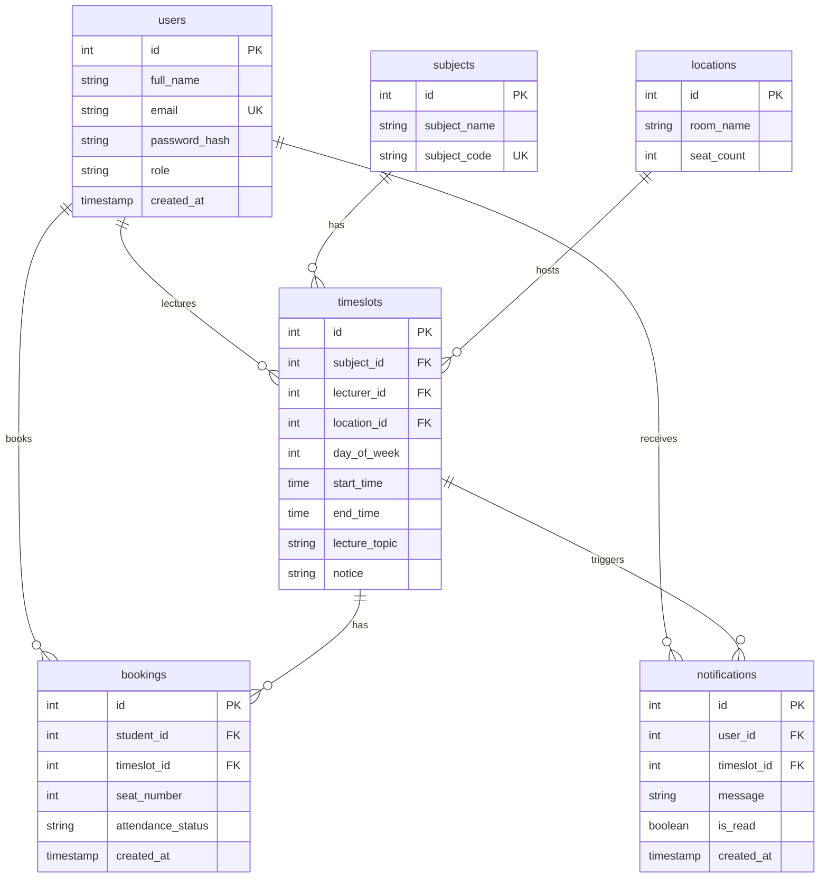

# UniHelp Database Setup Guide

This guide provides step-by-step instructions for setting up the PostgreSQL database for the UniHelp project.

---

## Prerequisites

Before starting, you need to have PostgreSQL installed on your computer.

### Option 1: PostgreSQL Installer (Recommended for Windows)

1. Go to [postgresql.org/download/windows](https://www.postgresql.org/download/windows/)
2. Download the installer for your Windows version
3. Run the installer and follow the setup wizard
4. During installation, you'll be asked to set a password for the `postgres` superuser - **remember this password!**
5. Keep the default port: `5432`
6. Complete the installation

### Option 2: Using a GUI Tool (Easier for Beginners)

Download **pgAdmin 4** (comes with PostgreSQL installer) or **DBeaver** (separate tool):
- pgAdmin: [pgadmin.org](https://www.pgadmin.org/)
- DBeaver: [dbeaver.io](https://dbeaver.io/)

---

## Step 1: Verify PostgreSQL is Running

After installation, verify PostgreSQL is running:

### Using Windows Services:
1. Press `Win + R`, type `services.msc`, press Enter
2. Look for `postgresql-x64-xx` (where xx is the version number)
3. Ensure the status is "Running"

### Using Command Line:
```cmd
psql --version
```
This should display the PostgreSQL version number.

---

## Step 2: Create the Database

### Method A: Using pgAdmin 4 (GUI - Recommended for Beginners)

1. Open **pgAdmin 4** from your Start menu
2. Enter your master password if prompted
3. In the left sidebar, expand **Servers** → **PostgreSQL**
4. Right-click on **Databases** → **Create** → **Database**
5. In the "Database" field, enter: `unihelp`
6. Click **Save**

### Method B: Using Command Line (psql)

1. Open Command Prompt or PowerShell
2. Connect to PostgreSQL as the postgres user:
   ```cmd
   psql -U postgres
   ```
3. Enter your postgres password when prompted
4. Create the database:
   ```sql
   CREATE DATABASE unihelp;
   ```
5. Connect to the new database:
   ```sql
   \c unihelp
   ```

---

## Step 3: Run the Schema and Dummy Data Scripts

### Method A: Using pgAdmin 4 (GUI)

1. In pgAdmin, navigate to your `unihelp` database
2. Click on **Query Tool** (Tools → Query Tool)
3. Open the file `z-database/init.sql` (File → Open)
4. Click **Execute** (F5 or the play button)
5. You should see "Query returned successfully" messages
6. Repeat for `z-database/dummy_data.sql`

### Method B: Using Command Line

From the project root directory, run:

```cmd
psql -U postgres -d unihelp -f z-database\init.sql
psql -U postgres -d unihelp -f z-database\dummy_data.sql
```

Enter your postgres password when prompted.

---

## Step 4: Configure Environment Variables

1. Copy the example environment file:
   ```cmd
   copy server\.env.example server\.env
   ```

2. Edit `server\.env` with your database credentials:

```env
# Server Configuration
PORT=5000

# Database Configuration
DB_HOST=localhost
DB_PORT=5432
DB_NAME=unihelp
DB_USER=postgres
DB_PASSWORD=your_actual_postgres_password_here

# JWT Configuration
JWT_SECRET=your_super_secret_jwt_key_here
JWT_EXPIRES_IN=7d

# Client URL (for CORS)
CLIENT_URL=http://localhost:5173
```

**Important:** Replace `your_actual_postgres_password_here` with the password you set during PostgreSQL installation.

---

## Step 5: Install Dependencies and Test

1. Install server dependencies:
   ```cmd
   cd server
   npm install
   ```

2. Start the server:
   ```cmd
   npm run dev
   ```

3. If successful, you should see:
   ```
   Connected to database successfully
   Server running on port 5000
   ```

---

## Database Schema Overview

The UniHelp database has 6 tables:

| Table | Purpose |
|-------|---------|
| `users` | Stores students, lecturers, and admins |
| `subjects` | University courses/subjects |
| `locations` | Lecture halls and rooms |
| `timeslots` | The main timetable (lecture sessions) |
| `bookings` | Student seat bookings for lectures |
| `notifications` | User notifications |

### Entity Relationship Diagram



---

## Test Users

After running the dummy data, you can log in with these accounts:

| Role | Email | Password |
|------|-------|----------|
| Admin | admin@unihelp.com | admin123 |
| Lecturer | john.smith@unihelp.com | lecturer123 |
| Lecturer | sarah.johnson@unihelp.com | lecturer123 |
| Lecturer | michael.brown@unihelp.com | lecturer123 |
| Student | alice.williams@student.unihelp.com | student123 |
| Student | bob.taylor@student.unihelp.com | student123 |
| Student | charlie.davis@student.unihelp.com | student123 |

**Note:** The passwords in the dummy data file are placeholder hashes. You'll need to generate real bcrypt hashes for actual login to work. See the next section.

---

## Important: Generate Real Password Hashes

The dummy data file contains placeholder password hashes. To make login work, you need to generate real bcrypt hashes.

### Option 1: Using Node.js Script

Create a temporary script in the server folder:

```javascript
// server/generate-hashes.js
const bcrypt = require('bcrypt');

async function generateHashes() {
    const passwords = ['admin123', 'lecturer123', 'student123'];
    
    for (const pwd of passwords) {
        const hash = await bcrypt.hash(pwd, 10);
        console.log(`${pwd}: ${hash}`);
    }
}

generateHashes();
```

Run it:
```cmd
cd server
node generate-hashes.js
```

Then update the `dummy_data.sql` file with the real hashes.

### Option 2: Update Passwords via SQL

After the database is set up, connect to it and run:

```sql
-- Update admin password
UPDATE users SET password_hash = '$2b$10$REAL_HASH_HERE' WHERE email = 'admin@unihelp.com';

-- Update lecturer passwords
UPDATE users SET password_hash = '$2b$10$REAL_HASH_HERE' WHERE role = 'lecturer';

-- Update student passwords
UPDATE users SET password_hash = '$2b$10$REAL_HASH_HERE' WHERE role = 'student';
```

---

## Troubleshooting

### "Connection refused" Error
- Ensure PostgreSQL service is running (check Windows Services)
- Verify the port is correct (default: 5432)
- Check if firewall is blocking the connection

### "Password authentication failed"
- Double-check your postgres password in the `.env` file
- Try connecting with pgAdmin to verify the password works

### "Database 'unihelp' does not exist"
- Run Step 2 again to create the database

### "Relation already exists" Error
- The tables were already created. You can drop and recreate:
  ```sql
  DROP SCHEMA public CASCADE;
  CREATE SCHEMA public;
  ```
  Then run the init.sql script again.

---

## Quick Reference Commands

```cmd
# Connect to PostgreSQL
psql -U postgres

# Connect to unihelp database
psql -U postgres -d unihelp

# List all databases
\l

# List all tables in current database
\dt

# Describe a table
\d users

# Exit psql
\q
```

---

## Next Steps

After the database is set up:

1. Start the server: `cd server && npm run dev`
2. Start the client: `cd client && npm run dev`
3. Open http://localhost:5173 in your browser
4. Try logging in with the test accounts
